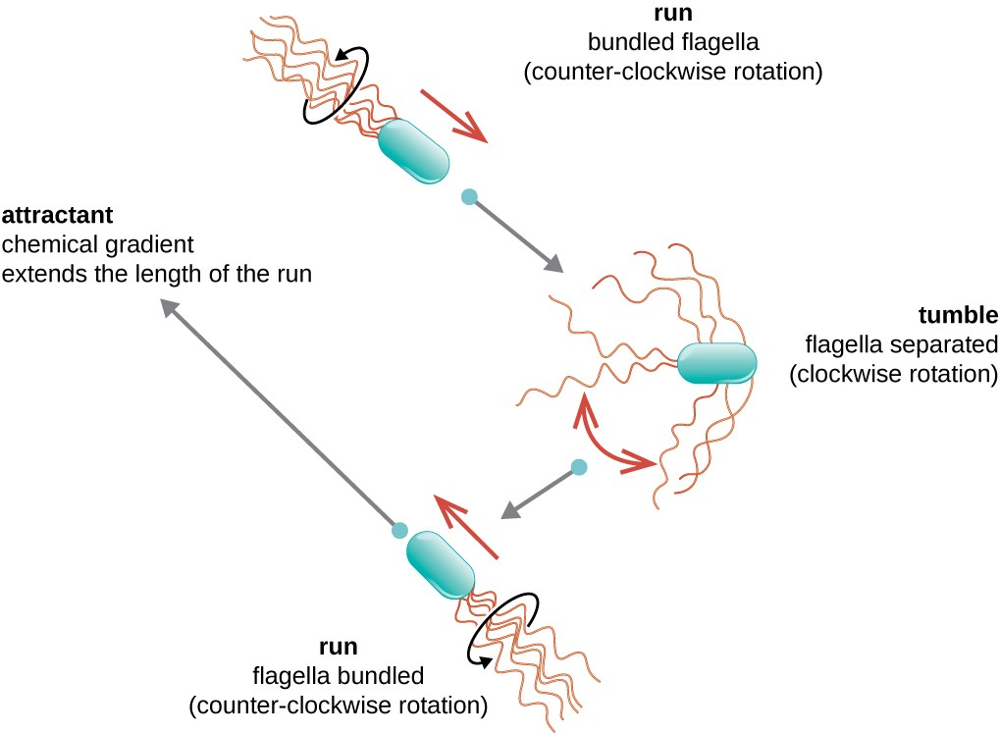

# programming_formalisms_project_summer_2024

The Programming Formalisms project of summer 2024.

## Goal

To simulate bacterial movement in 2D space.

One way to model bacterial movement is 
the run and tumble model,
where 'run' is going straight in a direction,
and 'tumble' is picking a random direction.
The 'run' lasts longer when a bacterium
finds more and more nutrients (e.g. dissolved
sugars), and lasts shorter
when finding less and less nutrients.

> Image from [coursehero](https://www.coursehero.com/study-guides/microbiology/unique-characteristics-of-prokaryotic-cells/)

## Internal links

 * [design](design/README.md): design documents
 * [learners](learners/README.md): place to keep notes and do exercises on an individual basis

## External links

 * [Programming Formalisms GitHub repository](https://github.com/UPPMAX/programming_formalisms)

## References

 * [Wang et al., 2011] Wang, Charles CN, et al. "Simulation of bacterial chemotaxis by the random run and tumble model." 2011 IEEE 11th International Conference on Bioinformatics and Bioengineering. IEEE, 2011.

test

aerohae[gheo;
sadasd
