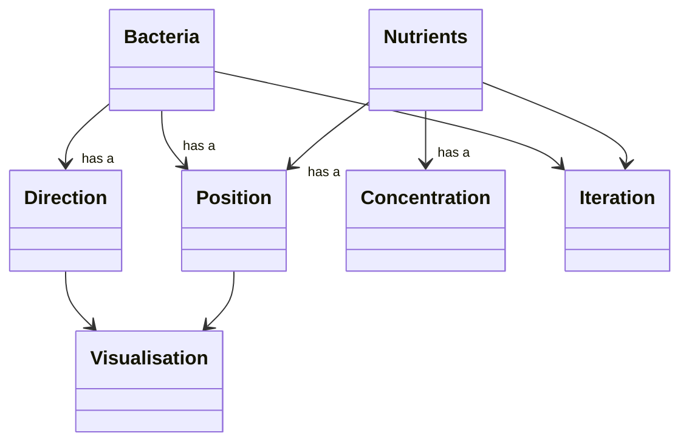

```mermaid
    classDiagram
        Position --> Visualisation
        Direction--> Visualisation
        Nutrients --> "has a" Position
        Nutrients --> "has a" Concentration
        Nutrients --> Iteration
        Bacteria --> "has a"  Direction
        Bacteria -->  Iteration
        Bacteria --> "has a" Position
```
