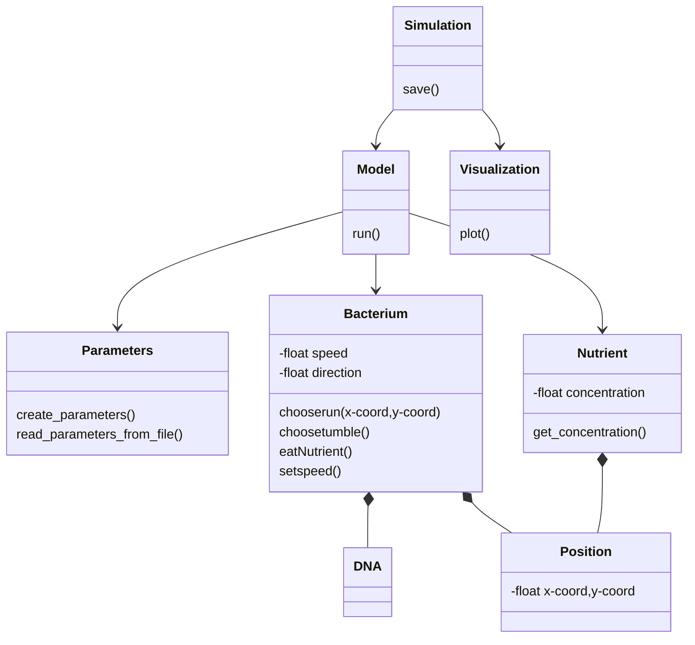

```mermaid

classDiagram

    Simulation --> Model
    Simulation --> Visualization

    Model --> Parameters
    Model --> Bacterium
    Model --> Nutrient
    Nutrient *-- Position
    Bacterium *-- DNA
    Bacterium *-- Position
    Bacterium 

    class Bacterium{
        -float speed
        -float direction
        chooserun(x-coord,y-coord)
        choosetumble()
        eatNutrient()
        setspeed() }

  class DNA {
    
  }


  class Model {
    run()
  }


  class Nutrient {
    -float concentration
    get_concentration()
  }

  class Parameters {
    create_parameters()
    read_parameters_from_file()  
  }

  class Position {
    -float x-coord,y-coord
  }

  class Simulation {
    save()
  }

  class Visualization {
    plot()
  }
```
