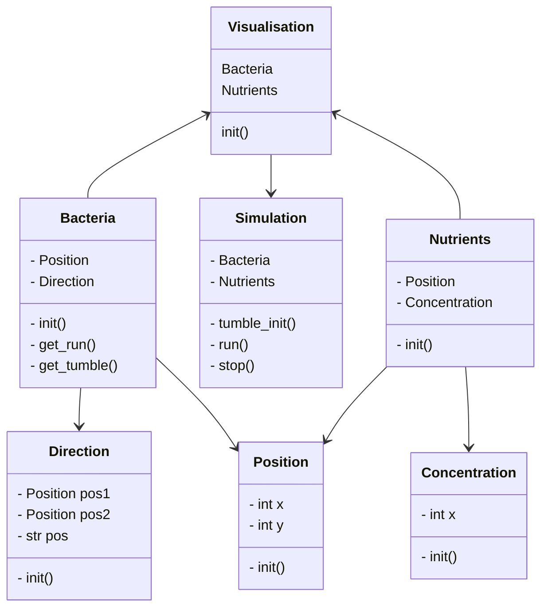

```mermaid

classDiagram
 Visualisation <-- Bacteria 
 Visualisation --> Simulation
 Visualisation <-- Nutrients
 Bacteria --> Direction
 Bacteria --> Position
 Nutrients --> Position
 Nutrients --> Concentration

class Visualisation{
    Bacteria
    Nutrients
    init()
}
class Bacteria{
    - Position
    - Direction
    - init()
    - get_run()
    - get_tumble()
}
class Nutrients{
    - Position
    - Concentration
    - init()
}
class Position{
    - int x
    - int y
    - init()
}
class Direction{
    - Position pos1
    - Position pos2
    - str pos
    - init()
}
class Concentration{
    - int x
    - init ()
}
class Simulation{
    - Bacteria
    - Nutrients
    - tumble_init()
    - run()
    - stop()
}

```
