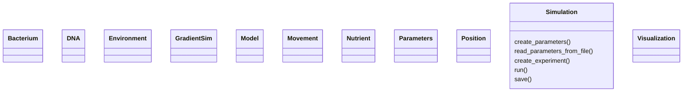

# Design documents

## Alphabetic list of classes

Class name                       |Owner
---------------------------------|---------------------
Bacterial                        |Jinling
DNA                              |Carmen
Environment                      |Cecillia
GradientSim                      |Karthik
Model                            |Fabio
Movement                         |Hyunho
Nutrient                         |Jenny
Parameters                       |Aitor
Position                         |Afsana 
Simulation                       |.
Visualization                    |Monika

## Class diagram

