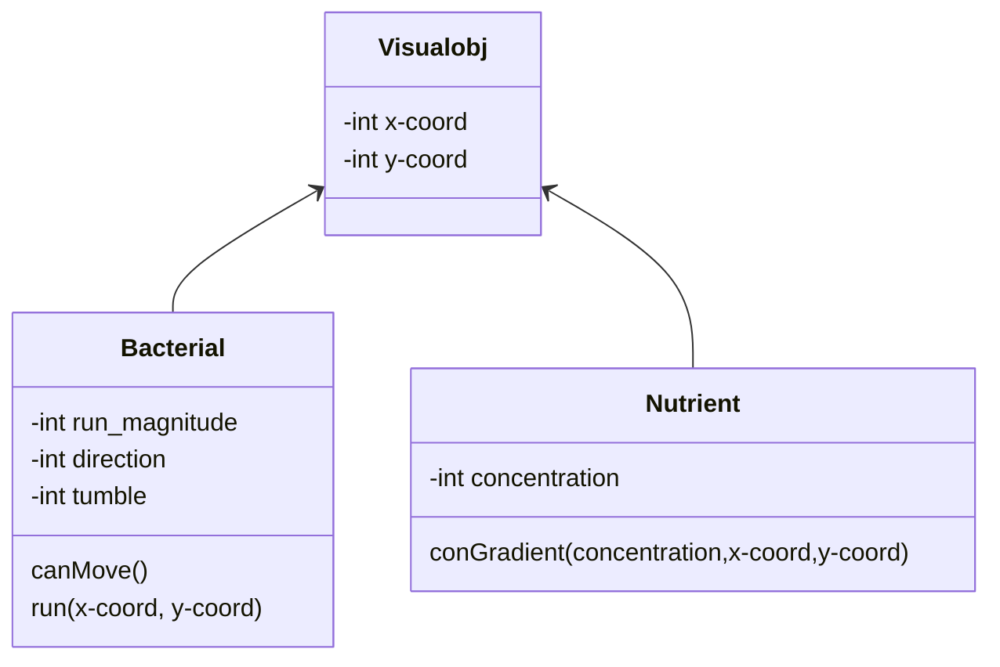

```mermaid
classDiagram
    Visualobj <-- Bacterial
    Visualobj <-- Nutrient
    Visualobj: -int x-coord
    Visualobj: -int y-coord
    
class Bacterial{ 
    -int run_magnitude
    -int direction
    -int tumble
    canMove()
    run(x-coord, y-coord)
    }

class Nutrient{
    -int concentration
    conGradient(concentration,x-coord,y-coord)
    }

```
