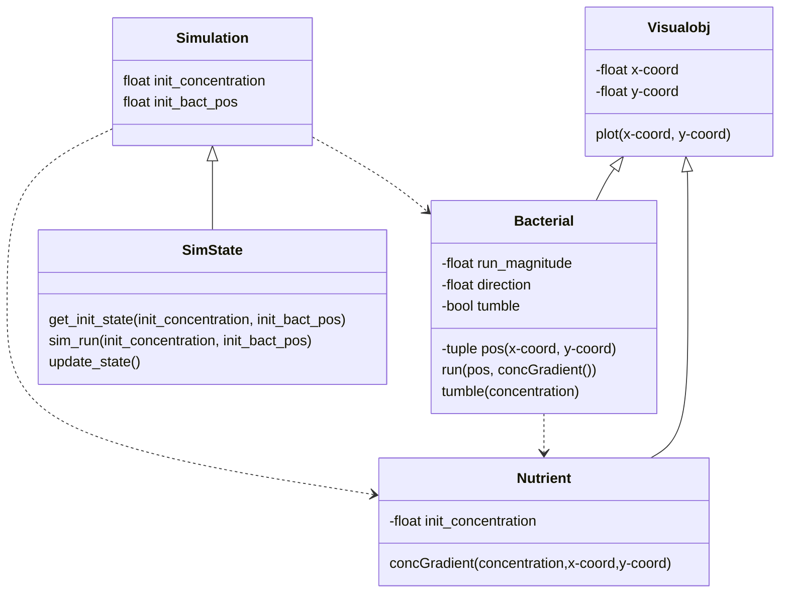

```mermaid
classDiagram
    Visualobj <|-- Bacterial
    Visualobj <|-- Nutrient
    class Visualobj{ 
        -float x-coord
        -float y-coord
        plot(x-coord, y-coord)
        }

class Bacterial{ 
    -float run_magnitude
    -float direction
    -tuple pos(x-coord, y-coord)
    -bool tumble
    run(pos, concGradient())
    tumble(concentration)
    }

class Nutrient{
    -float init_concentration
    concGradient(concentration,x-coord,y-coord)
    }

Bacterial ..> Nutrient

class Simulation{
    float init_concentration
    float init_bact_pos
    
}

class SimState{
    get_init_state(init_concentration, init_bact_pos)
    sim_run(init_concentration, init_bact_pos)
    update_state()
}

Simulation <|-- SimState
Simulation ..> Bacterial
Simulation ..> Nutrient
```
