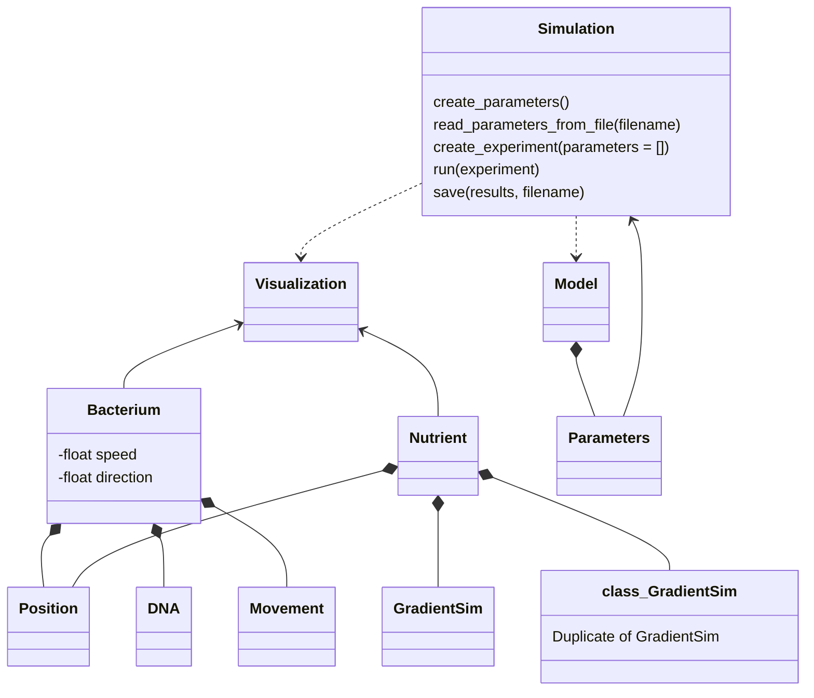

```mermaid
classDiagram

class Bacterium{
        -float speed
        -float direction
               }

  class DNA {
    
  }

  class GradientSim {
    
  }

 class class_GradientSim {
    Duplicate of GradientSim
    
  }

  class Model {
    
  }

  class Movement {
    
  }

  class Nutrient {
    
  }

  class Parameters {
    
  }

  class Position {
    
  }

  class Simulation {
    create_parameters()
    read_parameters_from_file(filename)
    create_experiment(parameters = [])
    run(experiment)
    save(results, filename)
  }

  class Visualization {
    
  }

Bacterium *-- Position
Visualization <-- Bacterium

Nutrient *-- Position
Nutrient *-- GradientSim
Nutrient *-- class_GradientSim

Visualization <-- Nutrient

Bacterium *-- DNA
Bacterium *-- Movement

Model *-- Parameters
Simulation ..> Model
Simulation ..> Visualization
Simulation <-- Parameters

```
