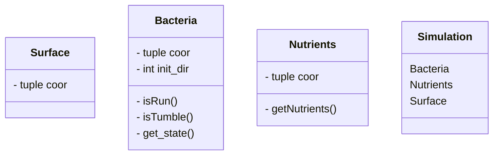

```mermaid
classDiagram
class Surface{
    - tuple coor
}

class Bacteria{
    - tuple coor
    - int init_dir
    - isRun()
    - isTumble()
    - get_state()
}

class Nutrients{
    - tuple coor
    - getNutrients()
}


class Simulation{
    Bacteria
    Nutrients
    Surface
}
```
