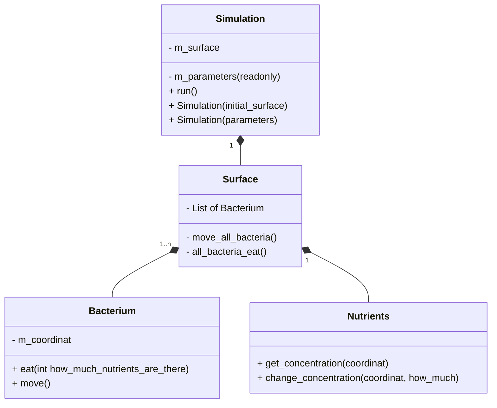

```mermaid
classDiagram

  class Simulation {
    - m_surface 
    - m_parameters (readonly)
    + run()
    + Simulation(initial_surface)
    + Simulation(parameters)
  }

  class Surface {
    - List of Bacterium
    - move_all_bacteria()
    - all_bacteria_eat()
  }

  class Bacterium {
    + eat(int how_much_nutrients_are_there)
    - m_coordinat
    + move()
  }

  class Nutrients {
    + get_concentration(coordinat)
    + change_concentration(coordinat, how_much)
  }

  Simulation "1" *-- Surface
  Surface "1..n" *-- Bacterium
  Surface "1" *-- Nutrients
```
